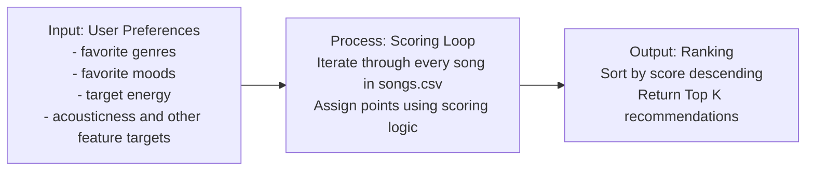

# 🎧 Model Card: Music Recommender Simulation

## 1. Model Name  

VibeFinder 1.0
---

## 2. Intended Use  

VibeFinder 1.0 generates personalized music recommendations based on four song features: mood, energy, genre, and acousticness. The system assumes that users can express their taste preferences (favorite genre, favorite mood, target energy level, and acoustic preference) directly. It works best for users with consistent musical preferences and comprehensive listening histories.

---

## 3. How the Model Works  

VibeFinder 1.0 uses a content-based approach. It scores each song by comparing its actual musical characteristics to what you tell it you like. Real-world systems like Spotify use a mix of strategies—some learn from what millions of users listen to (collaborative filtering), others analyze audio features directly (content-based), and most blend both. This starter system prioritizes being transparent and interpretable.

For each song, it measures four features: mood (happy, chill, etc.), energy level, genre, and acousticness. Afterwards, it combines these using weighted importance—mood and energy matter most (35% each), while genre and acousticness matter less (20% and 10%). The model uses a bell curve to measure closeness for numeric features like energy. A song with energy 0.75 is better for a user targeting 0.8 than one with energy 0.2. Finally, it ranks all candidate songs by their scores and serves up the top ones, ensuring you always get the best matches first.

---

## 4. Data  

The dataset currently contains 18 songs in a small, hand-curated CSV catalog. It started with 10 songs and was expanded by adding 8 new tracks to improve genre and mood coverage. The catalog includes genres such as pop, lofi, rock, ambient, jazz, synthwave, indie pop, electronic, hip-hop, country, folk, metal, reggae, soul, and blues. Moods include happy, chill, intense, relaxed, moody, focused, energetic, nostalgic, melancholic, playful, romantic, and sad.

Each row contains core audio-style fields (energy, tempo, valence, danceability, acousticness) plus newer numeric features (instrumentalness, liveness, speechiness). This makes the dataset more useful for distinguishing listening styles like rap/spoken tracks versus instrumental focus tracks.

Even with the expansion, the dataset is still limited. It does not capture features like language, lyrical themes, cultural context, release year effects, user listening history, skip behavior, time-of-day preferences, or social trends.

---

## 5. Strengths  

This system works well for users who can describe a clear genre, mood, and energy preference, especially when they want a simple list of songs ranked by how closely they match those choices. It captures obvious patterns like intense rock versus chill lofi, or instrumental versus speech-heavy tracks, because the scoring uses both categorical matches and numeric similarity. The recommendations also feel intuitive for straightforward tastes because the highest-ranked songs usually share the important features the user asked for.

---

## 6. Limitations and Bias 

This system can favor the song types that appear most often in the small CSV and it only considers the features it was given, so it may miss things like lyrics, culture, release year, or listening context. Because genre is weighted more than mood, genre matches can sometimes outweigh emotional fit.

---

## 7. Evaluation  

How you checked whether the recommender behaved as expected. 

Prompts:  

- Which user profiles you tested  
- What you looked for in the recommendations  
- What surprised you  
- Any simple tests or comparisons you ran  

No need for numeric metrics unless you created some.

---

## 8. Future Work  

Ideas for how you would improve the model next.  

Prompts:  

- Additional features or preferences  
- Better ways to explain recommendations  
- Improving diversity among the top results  
- Handling more complex user tastes  

---

## 9. Personal Reflection  

A few sentences about your experience.  

Prompts:  

- What you learned about recommender systems  
- Something unexpected or interesting you discovered  
- How this changed the way you think about music recommendation apps  
